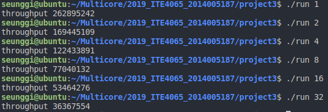

# Wait-free Snapshot
## Overview
Goal of this project is implementing Wait-free Snapshot.
## My blueprint
To implement Wait-free Snapshot, It needs atomic multi reader single writer register and snapshot. Standard variable can be used atomic MRSW register, and snapshot is made by array of snapValue. update call is wait-free until simple snapshot but scan call is not. So To correct this problem, update call helps scan call by collecting and saving snapshot. In scan call, first, copy snap values. Second, copy snap values again and compare both copies one by one. If different column exists, that thread is updating snap values and just check. Repeating this workload until same thread moved twice(move means update) or both copies are equal. The thread moves twice, previous update is over, so scan call can use snapshot of the thread. 
## Specific implentation

     class snapValue;
This class has thread size, time stamp, value, and snapshot of last update. 

    class WFSnapshot;
This class has thread size, and pointer of shared_ptr of snapValue. This class has four method, update, scan, collect, labelNum.

    void update(int tid, int64_t v);
Update value of thread tid to v. Increase label and value and snapshot.

    int64_t* scan();
Collect old copy of snapValue and Collect new copy of snapValue. If a snapValue is different, check the thread. If Same thread moves twice, then return snapshot of the thread. Or if old copy and new copy are equal, return new copy.

    valuePtr* collect();
Return copied array of shared_ptr of snapValue. 

    uint64_t labelNum(int tid);
Return last label of thread tid. This shows number of update call. 

## Analysis
Run in 1, 2, 4, 8, 16, 32 of thread respectively. 

As you see, Because of collecting and comparing in scan call, the more thread you have, the fewer updates you have.  