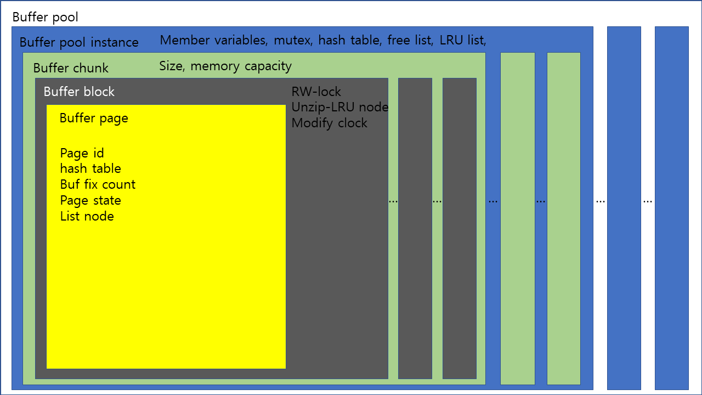
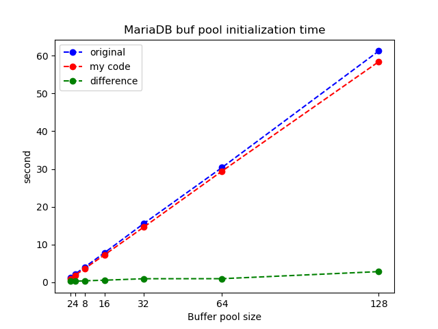

# Project 4 - Make MariaDB buffer pool initialization scalable

## Table of contents

- [Overview](#overview)

- [Buffer pool analysis](#buffer-pool-analysis)

- [Detail design](#detail-design)

- [Performance analysis of new version](#performance-analysis-of-new-version)

## Overview

 The goal of this project is to increase the performance of buffer pool initialization of MariaDB using multi-threads. I analyzed the code, identified the structure, analyzed which parts would be better paralleled, and then changed the code. I finished debugging on my computer and compared the performance of buffer pool initialization in size 2, 4, 8, 16, 32, 64, and 128 Giga bytes on the server. 

## Buffer pool analysis



 Perform the **buffer_pool_init** function in the **srv_start** function. Allocate as much memory as the buffer pool instance and initialize each instance with the **buffer_pool_init_instance** function. In the **buffer_pool_init_instance** function, create the mutex of the instance and initialize the list, such as free list and LRU list. And **buffer_chunk_init** function initiates each chunk and completes the initialization of the instance. The **buffer_chunk_init** function allocates memory by the allocated chunk size, rounds the block size to match memory, initializes each block with the **buffer_block_init** function, and adds pages from each block to the *free list* in the buffer_pool. Then register the chunks in the buffer pool and exit the function. The **buffer_block_init** function initializes all member variables in the block. 

## Detail design

I think the parts that can be paralleled are initialization of the chunks and initialization of the blocks. I decided to parallelize the blocks in a safer and simpler way, so I created a thread pool using the Concurrent Queue that I learned in class.  

- **my_queue**
  *  Because of the nature of my design, there is only one thread that does an *enqueue*, and the other threads are asleep during *enqueue*, so the **enqueue** function is not necessarily a lock free function. 
  *  For dequeue, it was implemented as a lock free because it can be called from multiple threads at the same time. And the original concurrent queue has to spin until the queue is empty, but I've implemented return NULL when the queue is empty or get signal from the outside.  

```c++
template<typename T>
class my_queue{
private:
	bool signal;
	const ulint QUEUE_SIZE;
	ulint front;
	ulint rear;
	std::vector<T> queue;
	std::vector<ulint> flag;
public:
	my_queue():signal(false), QUEUE_SIZE(10000), front(0), rear(0){
		queue.assign(QUEUE_SIZE, 0);
		flag.assign(QUEUE_SIZE, 0);
	}
	void enqueue(T data){
		ulint myrear = rear++;
		queue[myrear % QUEUE_SIZE] = data;
		flag[myrear % QUEUE_SIZE]++;
	}
	T dequeue(){
		ulint myfront = __sync_fetch_and_add(&front, 1);
		ulint myflag;
		while(1){
			if(signal) return NULL; 
			if(myfront >= rear) {
				front = rear;
				return NULL;
			}
			myflag = flag[myfront % QUEUE_SIZE];
			if(myflag % 2 == 1 && myfront / QUEUE_SIZE == myflag / 2) break;
			else std::this_thread::yield();
		}
		flag[myfront % QUEUE_SIZE]++;

		return queue[myfront % QUEUE_SIZE];
	}
	bool empty(){
		return (rear == front);
	}
	void exit_loop(){
		signal = true;
	}
};
```

- **my_thread_pool**
  *  When creating a thread pool, set the flag according to the number of threads. Initialize *task_queue* and threads. Each thread is stuck in the spin lock until the **main_sleep** function is called and is_active is changed to true. 
  *  Internal structure, *Job* made up of the function to be called in the thread and the argument data. The **push_task** function forces the *Job* to push to *task_queue*. 
  *  When you have put all the work into *task_queue* on the main thread, call main_sleep to activate the thread pool. The main thread remains in the spin lock until all operations are completed and the thread pool is disabled again when every job threads is finished. 
  * When *task_queue* is empty, the job threads check the *flag* and fall into the spin lock. 
  *  When the thread pool is deleted, change is_live to false, and then signal *task_queue* to join all the task threads and then delete the task queue. 

```c++
class my_thread_pool{
private:
	// thread's work
	typedef struct job{
		void (*work)(void *);
		void * arg;
	} Job;
	int size;
	bool is_active;
	bool is_live;
	ulint flag;
	ulint cur_flag;
	std::vector<std::thread> pool;
	my_queue<Job*>* task_queue;
	
public:
	void working(int id){
		while(1){
			if(!is_live) break;
			
			if(!is_active){
				std::this_thread::yield();
				continue;
			}

			Job* job = task_queue->dequeue();
			
			if(job == NULL){
				flag |= (1 << id);
				std::this_thread::yield();
				continue;
			}
			
			job->work(job->arg);
			delete job;
			
		}
	}
	my_thread_pool(int size):size(size), is_active(false), is_live(true), flag(0){
		cur_flag = (ulint)((1LL << size) - 1);
		task_queue = new my_queue<Job*>();
		for(int i = 0; i < size; ++i){
			pool.emplace_back(&my_thread_pool::working, this, i);
		}
	}
	~my_thread_pool(){
		is_live = false;
		task_queue->exit_loop();
		for(int i = 0; i < size; ++i){
			pool[i].join();
		}
		delete task_queue;
	}
	
	void main_sleep(){
		flag = 0;
		is_active = true;
		while(flag < cur_flag)
			std::this_thread::yield();
		is_active = false;
	}

	void push_task(void (*func)(void *), void * arg){
		Job *job = new Job();
		job->work = func;
		job->arg = arg;
		task_queue->enqueue(job);
	}
};
```

- **Buffer pool free list add**
  *  Adding pages to the list is not *atomic*. So, there's two way for adding element to list. Hold the mutex lock and add it to the list,  or pull out the parts that add to the list, and I chose the latter. 

```c++
block = chunk->blocks;
for(i = chunk->size; i--;){
    UT_LIST_ADD_LAST(buf_pool->free, &block->page);
    ut_d(block->page.in_free_list = TRUE);
    block++;
}
```


## Performance analysis of new version


 There's been little performance improvement contrary to my expectation . Time was reduced by one or two seconds from 128 gigs. As a result of thinking again, my implementation only push the initialization of one block to task_queue, so it's a bad performance because it's a big overhead. It would be better to parallelize the **buf_chunk_init** function or to make the work bigger for the queue. 